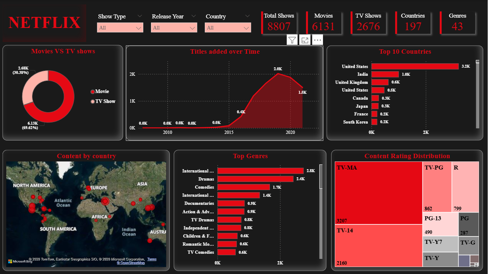

# Netflix Content Analysis Dashboard (Power BI)

## Project Overview
This project analyzes Netflix’s content library using Power BI to identify trends in content distribution, genre popularity, global reach, and audience targeting. The dashboard provides interactive visualizations that help understand Netflix's content strategy and growth patterns.

## Dashboard Preview

## Key KPIs
- Total Titles: 8,807
- Total Movies: 6,131
- Total TV Shows: 2,676
- Total Countries: 197
- Total Genres: 43

## Key Insights
- Netflix hosts 8,807 titles, indicating a large and diverse content library.
- Movies dominate the platform compared to TV shows.
- The number of titles added increased significantly after 2016, showing rapid platform expansion.
- The United States contributes the highest number of titles, followed by India and the United Kingdom.
- International Movies and Dramas are among the most common genres available on Netflix.
- Netflix content is distributed across 197 countries, demonstrating strong global presence.
- The platform includes 43 different genres, providing a wide variety of content categories.
- TV-MA and TV-14 ratings dominate the catalog, indicating the platform mainly targets teenage and adult audiences.

## Business Perspectives
- The dominance of movies suggests Netflix’s catalog focuses heavily on film-based entertainment.
- Rapid growth in titles after 2016 reflects Netflix’s aggressive content expansion strategy.
- High contributions from certain countries highlight major production hubs driving the platform’s content library.
- The popularity of international genres indicates strong global demand for diverse storytelling.
- The dominance of mature ratings suggests Netflix primarily targets teen and adult audience segments.

## Focus Areas
- Expanding original content production to maintain a competitive advantage in the streaming market.
- Increasing investment in regional and international content to attract global audiences.
- Maintaining a balanced mix of movies and TV shows to improve viewer engagement.
- Developing more family-friendly content to broaden audience reach.
- Strengthening Netflix’s global market presence through diverse content offerings.

## Tools Used
- Power BI
- Power Query
- Data Visualization
- Data Transformation

## Dataset
Netflix Titles Dataset

## Power BI File
Download the Power BI dashboard file from this repository:
Dashboard/Netflix_Movies_TV_Show.pbix
